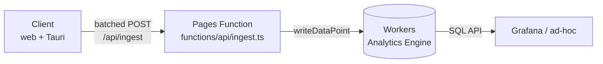
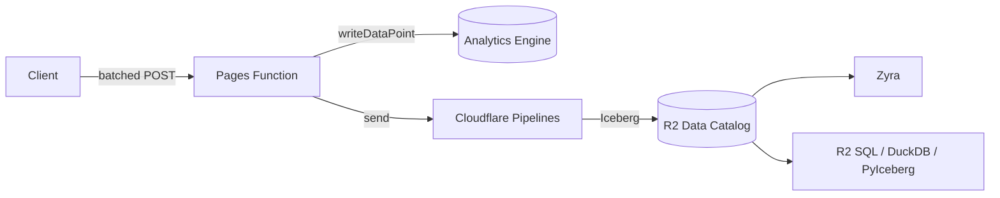

# Analytics Implementation Plan

Telemetry for Interactive Sphere — a structured event stream that answers
basic product questions (what layers are loaded, how long users dwell,
what Orbit interactions look like) and that Zyra can later ingest as a
first-class data source.

**Status: draft for review.** Tracking issue:
[#43](https://github.com/zyra-project/interactive-sphere/issues/43).
Scope is Phase 1 (Workers Analytics Engine + a minimal Pages Function)
with a sketch of Phase 2 (Pipelines → R2 / Iceberg → Zyra).

---

## Goals

- A small, well-defined event stream from the client (web + Tauri desktop)
- Queryable via SQL during development (Analytics Engine + Grafana)
- No third-party vendor, no data egress off Cloudflare
- Landed in a format Zyra can read directly in Phase 2 (R2 / Iceberg)
- Honest with users: a visible, truthful disclosure and a working toggle

## Non-goals

- Full product analytics (funnels, cohorts, session replay). If we need
  that later, revisit PostHog.
- User identity. Events carry an ephemeral session ID and nothing else.
- Real-time leadership dashboards. Phase 2+ concern.

---

## Constraints found during exploration

### 1. We have already promised users we don't do this

`src/ui/helpUI.ts:125` currently reads:

> Feedback submissions store the text you type plus your browser's user
> agent and the current page URL. Attaching a screenshot is optional and
> opt-in. **We do not collect analytics or tracking cookies.**

That sentence has to change the instant any telemetry ships. The plan
keeps faith with the spirit of the promise (anonymous, minimal,
user-controllable) and rewrites the copy to match reality.

### 2. Infrastructure already exists — don't build a second stack

The app is a Cloudflare Pages project with Pages Functions under
`functions/api/*`, a D1 database (`FEEDBACK_DB`) for ratings + general
feedback, and a Workers AI binding. `wrangler.toml` is a Pages config,
not a standalone-Worker config.

The issue proposes a separate Worker at `analytics.interactive-sphere.*`.
That works, but it adds a deploy target, a domain decision, and a second
CI path. **Phase 1 recommendation: land the ingest endpoint as a Pages
Function** (`functions/api/ingest.ts`) alongside the existing feedback
endpoints, with an Analytics Engine binding added to `wrangler.toml`.
Same origin as the app (no CORS, no subdomain politics), same deploy
pipeline, same local-dev story. Separate Worker remains available as a
Phase 1.5 escape hatch if we hit a scaling or isolation reason.

### 3. Feedback already has a home — don't double-write content

General feedback (`/api/general-feedback` → D1) and per-message AI
ratings (`/api/feedback` → D1) already capture the *content* of user
feedback with explicit consent (the submit button is the consent). The
`feedback` telemetry event is not a replacement — it is a lightweight
envelope (`kind`, `context`, `status`) emitted *alongside* the existing
D1 write so the funnel shows up in the event stream. The prose lives in
D1 where it already lives.

### 4. Web + desktop, one emitter

The Tauri desktop app shares 100 % of the TS. Analytics must work in
both. The ingest URL is relative (`/api/ingest`), which resolves to the
Pages origin on web and to the same origin via the existing Pages proxy
on desktop. Desktop uses the same lazy-loaded `@tauri-apps/plugin-http`
fallback pattern used by `llmProvider.ts` and `downloadService.ts` to
bypass webview CORS when it matters.

---

## Two-tier consent model

One flat "telemetry on / off" toggle forces a bad trade: either we
collect enough to answer product questions (but betray the existing
privacy copy) or we stay honest (and learn nothing). Two tiers
resolves that tension.

| Tier | Name | Default | Contents | User-visible |
|---|---|---|---|---|
| **A** | Essential | **ON**, disclosed | `session_start`, `layer_loaded`, `feedback` envelope | Mentioned in the Privacy section of the Help panel; toggle in Tools → Privacy |
| **B** | Research | **OFF**, opt-in | `dwell`, `orbit_interaction` | Checkbox in Tools → Privacy, opt-in copy explaining the research use case |
| **Off** | — | — | Emitter becomes a no-op; no network calls | A single "Disable all telemetry" control |

Tier A is the kind of aggregate usage signal every shipping app needs
to know whether a build is broken. It carries no free text, no
per-view timings, no prompt content. Tier B is the interactive /
behavioural layer — what users ask Orbit, how long they sit on a
layer. It's useful for research (and for Zyra training data downstream)
but crosses a privacy bar that warrants affirmative consent.

**Compile-time kill switch.** Both tiers honour a build flag:
`VITE_TELEMETRY_ENABLED=false` at build time dead-code-eliminates the
emitter entirely. Satisfies the issue's "verified by network
inspection" acceptance criterion for builds that ship without
telemetry (e.g., a federal-delivery build where infosec says no).

### Rewritten privacy copy

`src/ui/helpUI.ts` Privacy section becomes:

> **Feedback.** Submissions store the text you type plus your
> browser's user agent and the current page URL. Attaching a
> screenshot is optional and opt-in.
>
> **Anonymous usage data.** Interactive Sphere reports a small set of
> anonymous events — app starts, which data layers are loaded, and
> whether feedback was submitted — so we can tell which builds are
> healthy and which layers people reach for. Events carry a
> per-session random ID that is regenerated every launch and never
> linked to you. No cookies, no third-party vendors, no PII. You can
> disable this, or opt in to richer research telemetry, from **Tools
> → Privacy**.

---

## Phase 1 architecture



Same origin. One new Pages Function. One new binding in `wrangler.toml`.

### Event schema

Five event types, locked in at `src/types/index.ts`:

| Event | Tier | `blobs[]` (strings) | `doubles[]` (numbers) | `indexes[]` |
|---|---|---|---|---|
| `session_start` | A | `event_type`, `app_version`, `platform` (`web`/`desktop`), `locale` | — | `session_id` |
| `layer_loaded` | A | `event_type`, `layer_id`, `layer_source` (`network`/`cache`/`hls`/`image`), `slot_index` (as string) | `load_ms` | `session_id` |
| `feedback` | A | `event_type`, `context` (`general`/`ai_response`), `kind` (`bug`/`feature`/`other`/`thumbs_up`/`thumbs_down`), `status` (`ok`/`error`) | `rating` (−1 / 0 / +1) | `session_id` |
| `dwell` | B | `event_type`, `view_target` (e.g. `chat`, `info_panel`, `dataset:<id>`) | `duration_ms` | `session_id` |
| `orbit_interaction` | B | `event_type`, `interaction` (`message_sent`, `response_complete`, `action_executed`, `settings_changed`), `subtype` (e.g. action name), `model` | `duration_ms`, `input_tokens`, `output_tokens` (nullable) | `session_id` |

Design notes:

- `indexes[]` carries `session_id` only. Analytics Engine uses it for
  sampling/bucketing. One index slot per data point.
- Free text is never in `blobs[]`. Orbit prompt and response bodies are
  never emitted — only counts and tool names.
- Numeric measures always land in `doubles[]`; the ingest endpoint
  coerces and clamps (`load_ms` capped at 10 min, `duration_ms` at 4 h)
  to keep cardinality sane.
- `app_version` is read from a Vite `define` constant populated from
  `package.json`. Same source the feedback payload uses today.

### Client — `src/analytics/`

Three new files:

| File | Responsibility |
|---|---|
| `src/analytics/emitter.ts` | Typed `emit(event)` API, batch buffer (20 events or 5 s), tier gate, offline queue, fetch client (web `fetch` + lazy Tauri `plugin-http`) |
| `src/analytics/config.ts` | Load/save `TelemetryConfig` from localStorage (`sos-telemetry-config`), compile-time flag check |
| `src/analytics/dwell.ts` | `trackDwell(target)` helper — start/stop timer, emit on stop; handles `visibilitychange` and page-hide |

`TelemetryConfig` lands in `src/types/index.ts`:

```ts
export type TelemetryTier = 'off' | 'essential' | 'research'

export interface TelemetryConfig {
  tier: TelemetryTier          // default: 'essential'
  sessionId: string            // regenerated per app launch, never persisted
}
```

Session ID: `crypto.randomUUID()` generated once on boot, held in
memory only. Never written to localStorage or the Tauri keychain.

Offline queue (Tauri only, web just drops): persist the pending batch
to `localStorage['sos-telemetry-queue']` on `beforeunload` /
`pagehide`. On next boot, flush before first new event. Cap the queue
at 200 events; overflow drops oldest-first.

### Wiring table

| Event | File | Site |
|---|---|---|
| `session_start` | `src/main.ts` | After `await app.initialize()` in the `DOMContentLoaded` handler (~line 2049) |
| `layer_loaded` | `src/services/datasetLoader.ts` | `loadImageDataset` on `Image.onload`; `loadVideoDataset` on HLS `canplay`. Measure `load_ms` from function entry. `layer_source` is already known from the cache-vs-network branch |
| `feedback` (general) | `src/ui/helpUI.ts` | Wrap the existing `submitGeneralFeedback()` call — emit with `status` from the response |
| `feedback` (ai_response) | `src/ui/chatUI.ts` | Inside `submitInlineRating()` alongside the `/api/feedback` POST |
| `dwell` (chat) | `src/ui/chatUI.ts` | Start in `openChat()`, stop in `closeChat()` |
| `dwell` (info panel) | `src/services/datasetLoader.ts` | Start when info panel opens, stop when another dataset loads or the panel closes |
| `dwell` (dataset) | `src/main.ts` | Start in `loadDataset()` success; stop on next `loadDataset` or `goHome` |
| `orbit_interaction` (message_sent) | `src/ui/chatUI.ts` | `handleSend()` after user text is appended to state |
| `orbit_interaction` (response_complete) | `src/services/docentService.ts` | On the `done` stream chunk — carry `duration_ms`, token counts if the provider returned usage |
| `orbit_interaction` (action_executed) | `src/ui/chatUI.ts` | Inside the action-dispatch switch (load_dataset, fly_to, set_time, …) |

All Tier-B call sites short-circuit when `tier !== 'research'`, so a
miswire in a Tier-B site cannot leak a Tier-A event.

### Tools → Privacy UI

New section in the Tools popover (`src/ui/toolsMenuUI.ts`) and a small
panel (`src/ui/privacyUI.ts`) with:

- Radio group: Essential / Research / Off
- Read-only session ID display (helps users understand what's being
  sent and confirms it rotates per launch)
- Link to the Privacy section of the Help panel

Saves to `localStorage['sos-telemetry-config']`. Tier change takes
effect on next emit — no reload required.

### Server — `functions/api/ingest.ts`

```ts
interface Env {
  ANALYTICS: AnalyticsEngineDataset
}
```

Endpoint: `POST /api/ingest`. Body: a batch of events matching the
schema above. Pages Function responsibilities:

1. Content-type + size guard (reject > 64 KB bodies)
2. Zod validation against the five event shapes
3. Per-`session_id` rate limit — reuse the in-memory-per-isolate
   pattern from `general-feedback.ts` (5 req / 60 s / session)
4. `env.ANALYTICS.writeDataPoint({ blobs, doubles, indexes })` per
   event
5. Return `204 No Content` on success, `400` on schema error, `429`
   on rate-limit

`wrangler.toml` additions:

```toml
[[analytics_engine_datasets]]
binding = "ANALYTICS"
dataset = "interactive_sphere_events"
```

### Queries + dashboards

- Analytics Engine SQL API wired into Grafana as a datasource
- One dashboard, five panels: event volume (timeseries), layer load
  times (heatmap by `layer_id`), dwell distribution (histogram by
  `view_target`), Orbit interaction mix (stacked bar by `interaction`),
  feedback feed (table)
- Query patterns documented in a companion `docs/ANALYTICS_QUERIES.md`
  (to be landed with the first working ingest, not before)

---

## Phase 2 — R2 / Iceberg for Zyra

Client and Pages Function are unchanged. The Function fans out:



Changes:

- Pipelines binding added to `wrangler.toml`
- Iceberg schema mirrors the blobs/doubles/indexes layout, typed
  columns per event
- Zyra gains an R2 / Iceberg source adapter (tracked in the Zyra repo,
  not here)

Retention is solved automatically: Analytics Engine keeps 90 days
(hot), R2 / Iceberg keeps whatever we want (cold).

---

## Open questions

Carried over from #43, with my current leaning:

- **Separate Worker subdomain vs. Pages Function.** Recommendation
  above: Pages Function in Phase 1, revisit if we have a reason.
- **Domain / hosting.** Ingest lives at the app's own origin in the
  Pages Function path; the subdomain question goes away for Phase 1.
- **Retention.** Deferred to Phase 2 per the issue.
- **Consent / disclosure.** Addressed by the two-tier model + rewritten
  Help Privacy copy above. Juan Pablo should still review.
- **Schema ownership.** `src/types/index.ts` is the source of truth; the
  Pages Function imports the same types (same repo, same `tsconfig`),
  so drift is impossible by construction in Phase 1. Phase 2 factoring
  into a shared package is only needed once the Zyra adapter lands.

New questions this plan raises:

- **Do we want Tier A on by default for the desktop app specifically?**
  The Tauri build is the one with a keychain and local data; we could
  ship it with Tier A **off** by default and ask on first launch. Web
  defaults to Tier A on with disclosure.
- **Does the `feedback` envelope need the feedback `kind`?** That is
  already in D1. Including it in the event stream means we can build
  "which feature areas generate the most bug reports" without a
  cross-store join. I think yes, but it's borderline duplication.
- **Do we want `error` as a sixth event type** (uncaught exceptions,
  failed fetches, HLS errors)? Probably yes, but not in Phase 1.

---

## Acceptance criteria (from #43) → how this plan satisfies them

| Criterion | Addressed by |
|---|---|
| Running the Tauri app produces events visible in AE within 10 s | Batch flush interval = 5 s; AE ingest latency is sub-second |
| Grafana dashboard with the five panels, live data | Dashboards section above; lands with the first working ingest |
| Telemetry can be fully disabled via build flag, verified by network inspection | `VITE_TELEMETRY_ENABLED=false` → compile-time dead-code elimination; the runtime "Off" tier also zeros all network calls |
| `docs/ANALYTICS.md` documents schema, endpoint, queries | Split into this plan doc + a future `ANALYTICS.md` + `ANALYTICS_QUERIES.md` landed with the implementation PR |

---

## Files touched

**New:**

- `src/analytics/emitter.ts`
- `src/analytics/config.ts`
- `src/analytics/dwell.ts`
- `src/ui/privacyUI.ts`
- `functions/api/ingest.ts`
- `docs/ANALYTICS.md` (user-facing schema + endpoint reference)
- `docs/ANALYTICS_QUERIES.md` (SQL query patterns; lands with the
  Grafana dashboard)

**Modified:**

- `src/types/index.ts` — `TelemetryEvent` union, `TelemetryConfig`
- `src/main.ts` — emit `session_start`, wire dataset dwell
- `src/services/datasetLoader.ts` — emit `layer_loaded`, info-panel dwell
- `src/services/docentService.ts` — emit `orbit_interaction:response_complete`
- `src/ui/chatUI.ts` — emit `orbit_interaction:message_sent` / `action_executed`, chat dwell, AI-response `feedback`
- `src/ui/helpUI.ts` — emit general `feedback`, rewrite Privacy copy
- `src/ui/toolsMenuUI.ts` — Privacy entry in the Tools popover
- `wrangler.toml` — Analytics Engine binding
- `vite.config.ts` — `VITE_TELEMETRY_ENABLED` define + `__APP_VERSION__` constant if not already present
- `CLAUDE.md` — module-map rows for `src/analytics/*` + `src/ui/privacyUI.ts`

---

## Rollout order

1. Types + emitter + config, no call sites wired, compile-flag default
   `true`. Unit tests for batch / offline-queue / tier gating.
2. Pages Function + Analytics Engine binding. Deploy behind a
   feature-flag header so only internal clients hit the production
   dataset until we're happy.
3. Tier A call sites only: `session_start`, `layer_loaded`, `feedback`.
   Update `helpUI.ts` Privacy copy and ship the Tools → Privacy UI in
   the same PR.
4. Grafana dashboard + `ANALYTICS_QUERIES.md`.
5. Tier B call sites: `dwell`, `orbit_interaction`. Ship the opt-in
   checkbox copy alongside.
6. Phase 2: Pipelines + R2 / Iceberg. Separate issue, separate branch.
